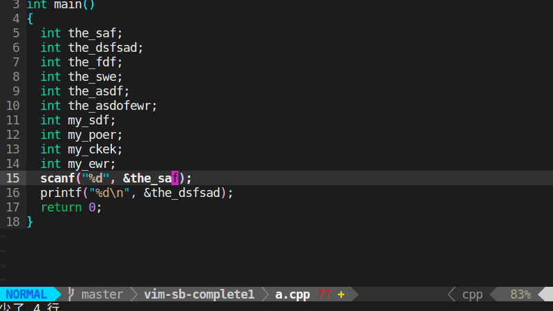
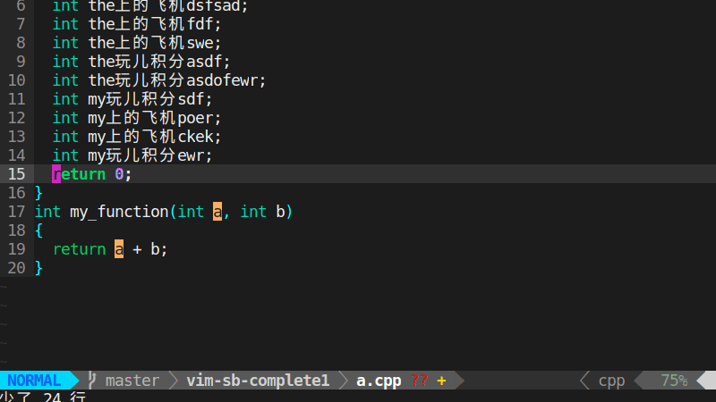

## `vim-sb-complete1`

the most lightweight(SHA BI) completion plug of vim

## Description



- complete the words behind/in words
- fix wrong spelling



- support for words next to CJK

### Installation

- manual
    - put the `autoload/sbcom1.vim` to `~/.vim/autoload/`
    - put the `plugin/sbcom1.vim` to `~/.vim/plugin/`

- `vim-plug`
    - add `Plug 'niabie/vim-sb-complete2'` to your `~/.vimrc`
        - execute `:PlugInstall` in vim

### Usage

1. add this to `~/.vimrc`, to start-up the plug

```vim
let g:sbcom1_active = 1
```

2. manual turning off or on
    - turn off `:SbCom2Off`
    - turn on `:SbCom2On`

3. The default trigger is `<tab>`. If you want to change the trigger, for example, replace `<tab>` with `<space>`, add this to your `~/.vimrc`

```vim
let g:sbcom1_trigger = "<space>"
```

another example, using a sequence `jkl` to replace `<tab>`

```vim
let g:sbcom1_trigger = "jkl"
```

Don't use this command in commandline directly

### Uninstallation

- manual
    - delete `autoload/sbcom1.vim`
    - delete `plugin/sbcom1.vim`

- `vim-plug`
    -  ~~`Plug 'niabie/vim-sb-complete2'`~~
        - execute `:PlugClean` in vim

